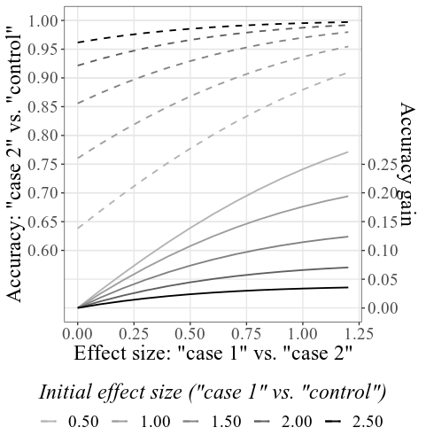
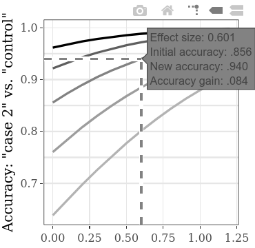
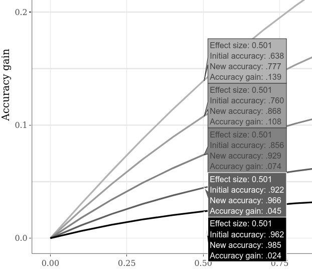
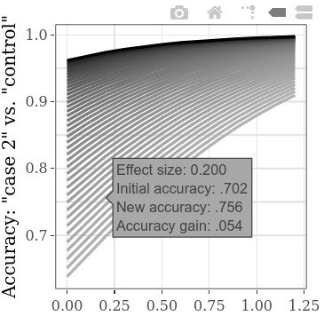

[](https://zenodo.org/badge/latestdoi/259343553)

### ESDI: Effect Sizes versus DIagnostics

Using simulations for the given input values, this Shiny R application shows how diagnostic efficency (as measured by rates of correct detection or areas under the curves) changes in relation to standardized mean difference (_SMD_) effect size differences between single-condition cases (when these are directly compared for lack of controls).

### How to Use

#### Access / Installation

The application is available online (to be simply opened in any web browser): https://gasparl.shinyapps.io/esdi/

However, it is also easy to run it from your PC. You just need to run the following command in **R**:

```R
shiny::runGitHub("esdi", "gasparl")`
```

For this latter alternative, if you don't have them already, you need to [install **R**](https://www.r-project.org/ "R project") and then install the `shiny` package within **R** e.g. by entering `install.packages("shiny")` into the console. Then copy the line `shiny::runGitHub("esdi", "gasparl")` e.g. in the console and press Enter. The necessary components will be automatically downloaded and the application will open up in a new window.

Finally, to use the application any time without internet access, you can download the entire repository (or just _app.R_) and run the code in the _app.R_ file. For this, you would need to install all R packages used in the code (listed in the first lines).

#### Interface

To quickly grasp the essence of the application, see the _Example_ section below, or see _Background_ for the general motivation. What follows here is a detailed technical explanation.

The only settings that influence the key SMD-diagnostics relation is the (ratio of) standard deviations (SDs) of the predictor values for _Cases_ and for _Controls_, which represent the generally assumed SD for the data from positive cases and for the data from controls, respectively (again, for more explanation, see the _Background_ and _Example_ sections below). The SDs should be estimated based on the typical SDs for cases and controls in the given research area. However, SD differences have relatively little impact on the results, and for most cases (where the SD is not known or cannot be easily estimated) it can be assumed that leaving the default settings (`1` for both SDs) will still give approximately correct results (unless the _Case SD_/_Control SD_ may be very large or very small). In other words, the default settings of this software are probably applicable for most scenarios.

Based on the given SDs, means of the samples are automatically calculated for each of the SMDs specified under the other settings. _Note: To be brief and yet avoid abbreviation, SMD (Standardized Mean Difference) is indicated as "Effect Size" for option and plot labels on the interface._ Datasets are generated for all the different means (using the two constant SDs) with near-perfect normal distribution. The specification of SMDs is fairly straightforward: a starting value, an end value, and a step must be given. For example, a start of `0.2`, an end of `0.6`, and a step of `0.1` will define the following SMDs: `0.2`, `0.3`, `0.4`, `0.5`, `0.6`. Smaller step (or more distant start and end) means more datapoints to calculate, and therefore these settings can substantially increase calculation time.

It is important to keep in mind the difference between (a) SMD between single-conditions ("case 1" vs. "case 2") and (b) the SMD between the case and control of a single condition ("case" vs. "control"). The first one (a) is indicative of differences in diagnostic efficiency between two diagnostic methods (e.g. an old method and a new improved method), while the second one (b) is merely an alternative measurement for diagnostic efficiency within a given method (e.g. the diagnostic efficiency of the old method), and this latter is always in direct positive correlation with the other diagnostic efficiency measures (so larger "case" vs. "control" SMD always means larger rate of correct detection and larger area under the curve).

The initial "case 1" vs. "control" SMD represents the assumed diagnostic efficiencies of the method to be improved (method 1). (Note: It is possible but makes little sense in practice to include zero for start value, unless for demonstration purposes, since that would mean that method 1 perform at chance level, so it's useless in the first place.) The plots depict the improved method's (method 2's) diagnostic efficiency (_Accuracy: "case 2" vs. "control"_)  in relation to the "case 1" vs. "case 2" SMD. (Note: For clarity, it is always good to keep the start value of the "case 1" vs. "case 2" SMD at zero, which then illustrates the starting point where there is no difference yet at all between the two methods.) Then it can be seen how the increases in the SMD between "case 1" and "case 2" lead to certain extents of improved accuracy, for each specified initital accuracy (as separate lines on the plot): This is the essence of this entire application.

The values are depicted in two different ways: as _total accuracy_, and as _accuracy gained_. Accuracy gained is calculated simply as total accuracy minus initial (method 1) accuracy. The combined plot contains both types, while the subplots depict these types separately, and may be explored interactively by hovering over the lines with the cursor to read the precise values of SMDs and accuracies at the given points on the plot (see the _Example_ section below).

Since the sample size is not infinite, the normal distribution can never be truly perfect, and therefore there will be small deviations in the calculated SMD results as compared to the given SMD settings: for example, one initial SMD may be given as `0.5` in the settings, but the actual results may be, for example, `0.51`. Sample size (number of generated datapoints) can be set under the label `Sample size`: larger number leads to somewhat increased calculation time, but more precise results. An sample size of around `4000` will typically give precision up to two fractional digit, while ca. `15000` may be precise up to three fractional digits. Importantly, regardless of sample size (and the correspondance of settings and results), the relation of SMD and diagnostics for the given results is always exact and correct.

The Plot settings relate to the depiction of the data, and should be self-explanatory. All values for the calculation of the plots are available under the Table tab in an interactive data table.

### Background

Prospective (_a priori_) power analysis to determine the required sample size is crucial for behavioral experiments (e.g., Perugini, 2018). To determine the smallest effect of interest required for the power analysis, the ideal way is to rely on objective justification (Lakens, 2013; Lakens et al, 2018). For example, to compare two different diagnostic methods, one may consider the real life implications of a given increase in the rate of correct detections of a disease in relation to the costs of the sample size required to show statistical evidence for that given increase. A researcher may make the informed and careful decision that it is worth to collect, say, 120 participants to detect an increase of at least 8% in detection accuracy: A 2% or even 0.1% increase could also have important real life benefit, but due to limited resources it is not worth collecting the much larger sample sizes required to detect such smaller changes.

However, the practical implication are not always so straightforward to assess. In one specific scenario in experimental design, two diagnostic methods may be validly compared using single-condition cases, omitting controls (a.k.a. "baseline" or "negative condition") to spare resources. This scenario can occur in any of the many fields applying binary classification, perhaps most characteristically in medicine. A hypothetic disease might be diagnosed with a continous measure _X_, which is typically higher for persons with a given disease (such as a small bump or redness in reaction to a skin prick test; positive cases), while it is generally the same for healthy persons (such as no or little reaction to a skin prick test; negative cases). Thereby positive cases can be detected with a certain accuracy – but not perfectly, because some of the measurements are to some extent faulty and give mistakenly low values for positive cases too. If someone proposed an improvement on the procedure to achieve higher values in measure _X_, it would be possible to directly compare the two methods on positive cases only: Since the measure will always be constant (low) in negative cases (healthy persons), higher values for positive cases means that the procedure will also have better diagnostic efficiency.

The problem here is that the effect size for the potential power calculation is between two positive conditions, which have no direct implication for the practical consequences in diagnostics. The present software helps by providing estimations for diagnostic efficiency values (correct detection rates and areas under the curves) for given effect sizes between positive conditions alone.

### Example

This software was actually inspired by Concealed Information Test (CIT) studies: The CIT can reveal that a person recognizes a relevant _probe_ item (e.g. a specific murder weapon used in a recent crime) among other, _irrelevant_ items (e.g. other plausible weapons), based on different, e.g. slower responding to the probe compared to the irrelevant items. Since innocent persons do not recognize the probe as relevant, their responses will in on average not differ between probe and irrelevant items. Hence, based on larger probe-minus-irrelevant (_P-I_) differences, guilty persons can be distinguished from innocent ones. Crucially, since the P-I is always around zero for innocents, many studies compare different versions of the CIT by using only guilty groups, with the understanding that larger P-I group mean for a given version means that the diagnostic efficiency will also be better using that version (i.e. more guilty persons can be correctly distinguished from innocent ones). However, the difference in the arithmetic mean between two guilty groups (or the related SMD) does not really have any sensible practical implication, and therefore it cannot be used for an educated decision on sample size. Indeed, 13 out of 24 studies collected in a recent meta-analysis (Lukács & Specker, 2020) used single-condition comparison, none reported prior power calculation for sample sizes, and even the interpretation of effect sizes were based on Cohen's famous but in the end arbitrary benchmarks, with no direct practical meaning (Cohen, 1988; Lakens et al, 2018).

Now, this meta-analysis also reported average SDs (based on 12 experiments) for cases (guilty groups) and controls (innocent groups), `33.6` and `23.5`, respectively – so these may be used in the ESDI application as input values for _Case SD_ and _Control SD_. However, using the default value of `1` for both SDs actually gives very similar results: In general, knowing and giving precise SD estimates is not vital (unless the _Case SD_ / _Control SD_ ratio may be very large or very small).

Giving the `33.6` and `23.5` for _Case SD_ and _Control SD_, `4000` for _Sample size_, and leaving all other settings unchanged, the main combined plot will look like this:



Note that – as explained in detail under the _How to use_ section above – initial accuracies are calculated based on the given initial SMDs (see bottom label; under Plot settings this label can be changed to display accuracies instead of SMDs). The resulting SMDs may slightly differ from the SMDs given in the settings, due to the simulation process (again, see _How to use_ for technical details).

The increase of _total accuracy_ or the analogous _gained accuracy_, in the function of the increase in between-condition (guilty 1 vs. guilty 2) SMD, can be explored separately on the interactive subplots. For example, hovering over the line as shown below, the label that appears shows that if we find an effect size (SMD) of 0.601 between the results of two guilty groups, given an initial accuracy of .856 (rate of correctly detected persons, both guilty and innocent), the accuracy increases by .084 (hence yielding a new accuracy of .940). If we assume that the initial accuracy (i.e., the accuracy using the method with the inferior diagnostic efficiency) of this type of CIT is indeed generally around .856, we can use the SMD values on this line for power calculation. For example, with the SMD 0.6, for a power of .9, the required sample size per group is 60 (for an unpaired t-test with alpha = .05). Hence, to statistically detect an increase of at least .084 in detection accuracy, a total of 120 persons need to be collected for the two guilty conditions.



Alternative initial accuracies can be compared by, for example, switching to the _Large Interactive Subplots_ tab, clicking the "Compare data on hover" option on the lower plot, and moving the cursor horizontally along the plot. The example below shows various accuracy gains when the "case 1" vs. "case 2" SMD is 0.5. As it was apparent already on the previous example plots, lower initial accuracy always allows larger accuracy gain.



To explore more initial starting values at the same time, the step setting for "case 1" vs. "control" SMD can be lowered, leading to more lines on the plot (and to somewhat increased calculation time). (The step for the "case 1" vs. "case 2" SMD will analogously result in more horizontal datapoints.)



By default, simple rates of correct detection (number of all correctly classified subjects divided by the number of all subjects) are displayed for "accuracy" measurement, since this is probably the most straightforward indicator of diagnostic efficiency. It can be changed to area under the curve under the "Plot" tab in the left panel. Under the same tab, plot labels can also be customized.

### Testing

The basic functionality of the software can be verified using the `shinytest` package to run an automated test suit (e.g. after making contributions). Just run `shinytest::recordTest("/path/to/directory/")` – where `"/path/to/directory/"` should be replaced with the path to the applications directory, e.g. `"C:/apps/esdi/"`.

### Support

If you have any questions or find any issues (bugs, desired features), [write an email](mailto:lkcsgaspar@gmail.com) or [open a new issue](https://github.com/gasparl/esdi/issues "Issues").

### References

Cohen, J. (1988). Statistical power analysis for the behavioral sciences (2nd ed.). Hillsdale, NJ: Erlbaum.

Lakens, D. (2013). Calculating and reporting effect sizes to facilitate cumulative science: A practical primer for t-tests and ANOVAs. Frontiers in Psychology, 4. https://doi.org/10.3389/fpsyg.2013.00863

Lakens, D., Scheel, A. M., & Isager, P. M. (2018). Equivalence Testing for Psychological Research: A Tutorial. Advances in Methods and Practices in Psychological Science, 1(2), 259–269. https://doi.org/10.1177/2515245918770963

Lukács, G., & Specker, E. (2020). Dispersion Matters: Evaluation Procedures and Control Data Computer Simulation in Concealed Information Test Studies. Manuscript submitted.

Perugini, M., Gallucci, M., & Costantini, G. (2018). A Practical Primer To Power Analysis for Simple Experimental Designs. International Review of Social Psychology, 31(1), 20. https://doi.org/10.5334/irsp.181

